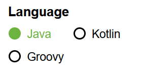

# Spring boot Project Setup
To create new spring boot project we need to visit spring initializer website.

Please click on this link <a href="https://start.spring.io/" target="_blank">**Spring Initializer**</a>

### Project
Select the project type as **Maven**

Project ==> Maven

### Language

Select the language as **Java**

### Spring Boot 

Select the Spring Boot version **3.2.4**

### Project Metadata

1) Group        ==> **com.learn**

2) Artifact     ==> **employeeservice**

3) Name         ==> **employeeservice**

4) Description  ==> **Learning Project by Using Java and Spring Boot**

5) Package name ==> **com.learn.employeeservice**

6) Packaging    ==> **Jar**

7) Java ==>     **17**
