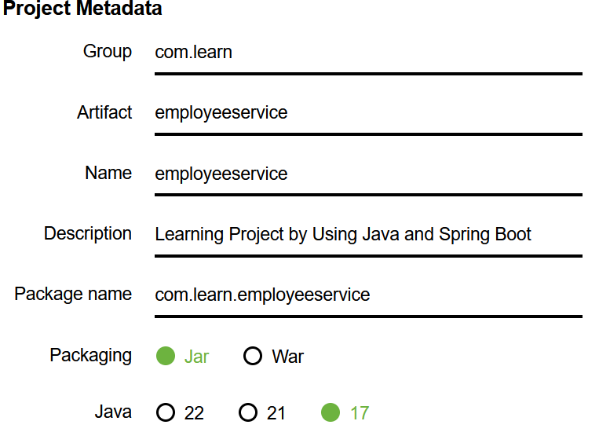
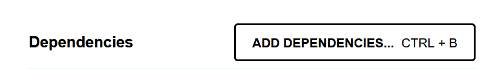
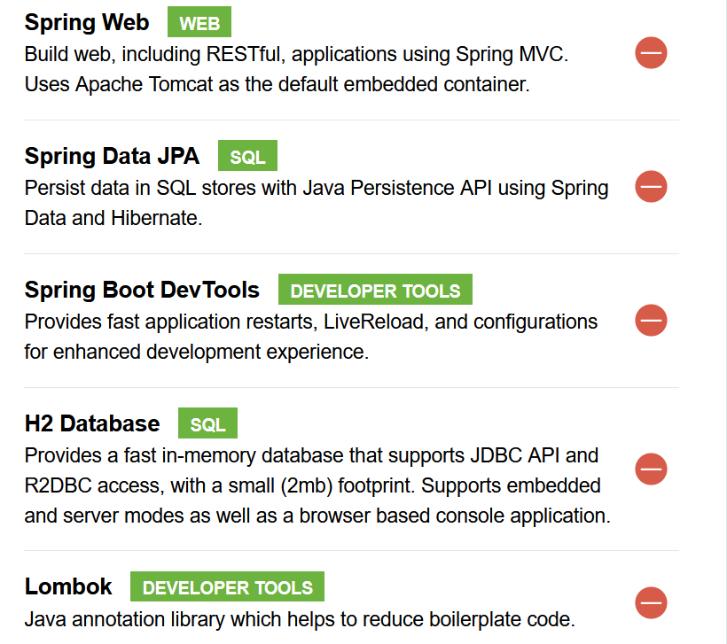
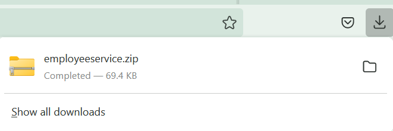
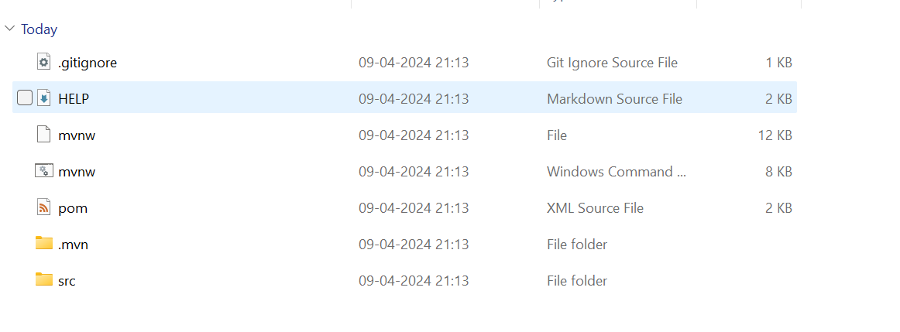

# Spring boot Project Setup
To create new spring boot project we need to visit spring initializer website.

Please click on this link <a href="https://start.spring.io" target="_blank">**Spring Initializer**</a>

## Project

Select the project type as **Maven**

Project ==> Maven

## Language

Select the language as **Java**

## Spring Boot 

Select the Spring Boot version **3.2.4**

## Project Metadata

Now copy below mentioned info

1) Group        ==> **com.learn**

2) Artifact     ==> **employeeservice**

3) Name         ==> **employeeservice**

4) Description  ==> **Learning Project by Using Java and Spring Boot**

5) Package name ==> **com.learn.employeeservice**

6) Packaging    ==> **Jar**

7) Java ==>     **17**

## Dependencies
Please click on ADD Dependencies to add project library dependencies.

Select below libraries
1) Spring Web
2) Spring Data JPA
3) Spring Boot DevTools 
4) H2 Database
5) Lombok 

## Generate Project

Click on Generate project. So that we can dowload project zip folder into our dowload folder

## Downloaded folder

Once you click on Generate You are able to see
downloaded project like this

## Extract Project

Now extract the project by using your favorite
uncompresson software

Now you are able to see project folders like this

