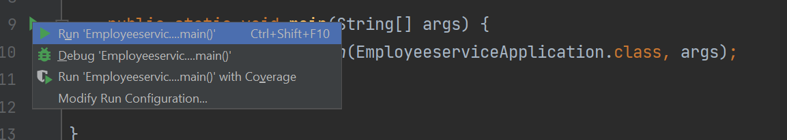

## Open employeeservice project from Intellij
Now open Intellij Editor.

Click on File -> New -> Project from Existing Sources

Now Select employeeservice project from the folder where you saved the code

**Import Project as Maven Project**

Now click on **Finish** button

## Running Application From Intellij

Now open EmployeeserviceApplication Class from src/main/java/com.learn.employeeservice folder

Now select mouse Right click to see **Run** option at main method. Click on Run option.
Now your spring boot application is going to run.

## Applicaton Console

You are able to see a console with below details

## Congratulations
Congratulations :) Now You are able to run project code from intellij.

