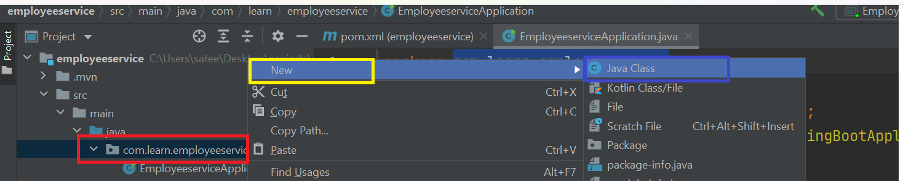

## Creating HelloWorldController file :-

create new java class by Right clicking on src/main/java/com.learn.employeeservice folder
like shown below.



Now you are going to see HelloWorldController file like below


## Adding greet method to the controller like shown below.

```
    public String greet() {
        return "Welcome to Java & Spring Boot World! ";
    }
```

From above method we are returning 
a string "Welcome to Java & Spring Boot World!"

## Display Greeting Message Via Rest Api Call

To access this greeting message from api call,
We need to add @RestController annotation on top of the HelloWorldController class name like shown here.

```
@RestController
public class HelloWorldController {

}
```

To access greet message via Get method call, We need to add
 @GetMapping annotation on top of the greet method like shown below

```
    @GetMapping("/welcome")
    public String greet() {
        return "Welcome to Java & Spring Boot World! ";
    }
```

## Final version of the code :-

Final version of the code looks like this

```
@RestController
public class HelloWorldController {

    @GetMapping("/welcome")
    public String greet() {
        return "Welcome to Java & Spring Boot World! ";
    }
}

```

## ReRun Application :-  

Now Rerun your application code to see latest changes.

By default Spring boot application is going to run in **8080 port**.
So you can see greet message by clicking on this link from the browser/postman/insomnia.

http://localhost:8080/welcome

**Note** :- We can also change the port number of our application. Here I have changed the port number to 8081.
We can discuss about this in later parts.


## Congratulations
Congratulations :) Now You are able to add HelloWorld Controller to the project code from intellij.

