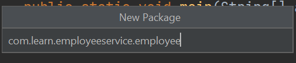
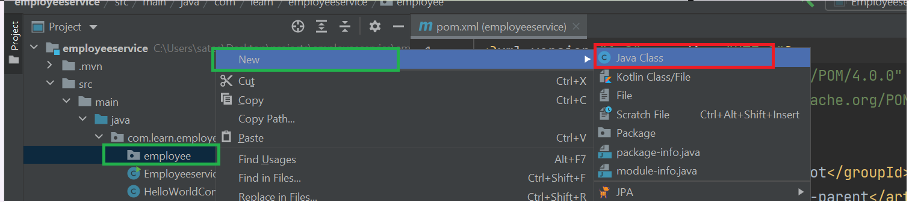

# Introduction :-
In this guide we are going to discuss about

1) Entity creation

2) Repo creation

3) Service Creation

4) Controller Creation

5) Database configuration in application.properties

6) Adding data.sql with sql queries.

7) Reading Employee Data


### Adding employee package :- 
Let us create a package with name employee in src/main/java/com.learn.employeeservice.




## Employee Entity Creation :-

Let us create a new java class i.e Employee file inside employee folder.




### Adding Fields inside Employee :-
Let us add below fields

1) Id (Long/int type)

2) Name (String type)

3) Age (Integer type)

4) isActive (Boolean type)

5) Salary (Double type)

### Employee class with Fields information :-
```
package com.learn.employeeservice.employee;

public class Employee {
    private Long id;
    private String name;
    private int age;
    private boolean isActive;
    private double salary;
}

```
### Adding Annotations in employee class

@Entity - The class annotated with @Entity informs spring boot this is
entity class and it can be mapped to a db table.

@Table - Using this annotation we can give database table name.

@Getter - its shortcut annotation for creating all getter methods
@Setter- shortcut annotation for creating all setter methods.

Let us add all these annotations to the Employee Entity class.

## Final Version of Employee Entity

````
package com.learn.employeeservice.employee;

import jakarta.persistence.Entity;
import jakarta.persistence.Table;
import lombok.Getter;
import lombok.Setter;

@Entity
@Table(name="employee")
@Getter
@Setter
public class Employee {
    private Long id;
    private String name;
    private int age;
    private boolean isActive;
    private double salary;
}
```


