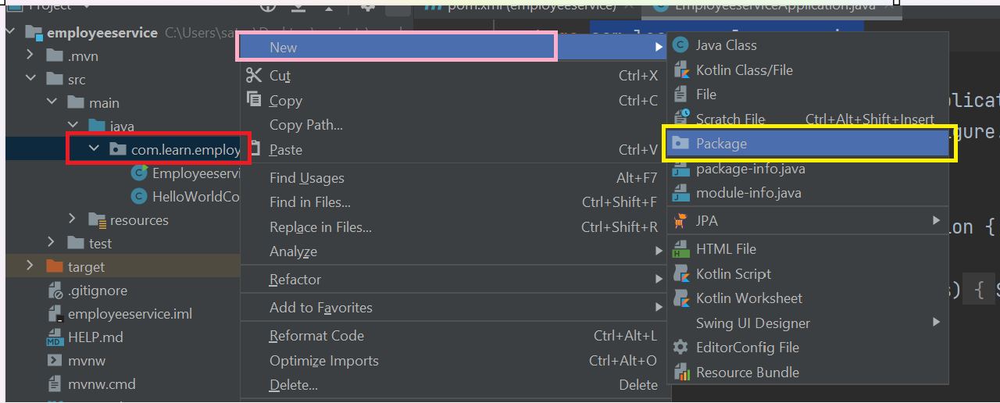
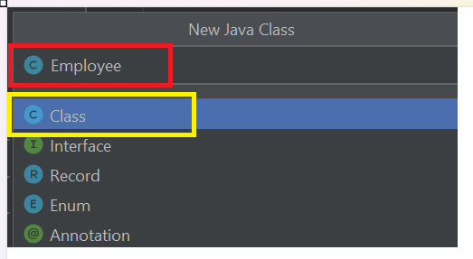
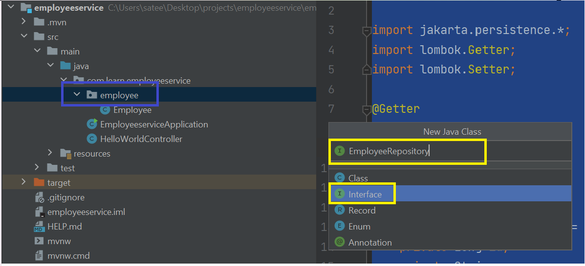
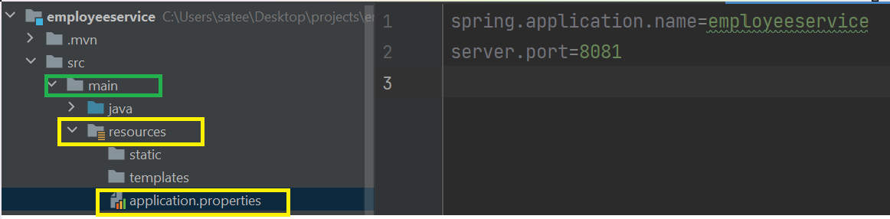
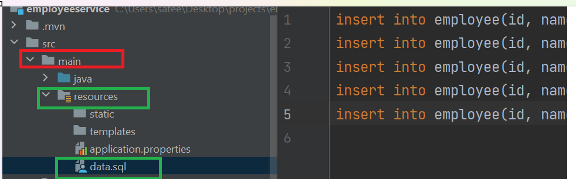
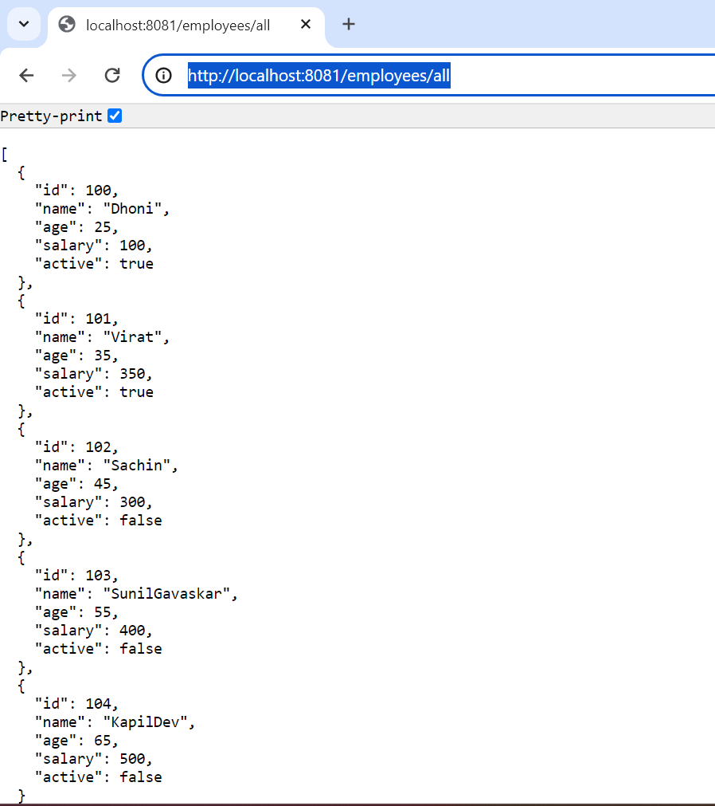
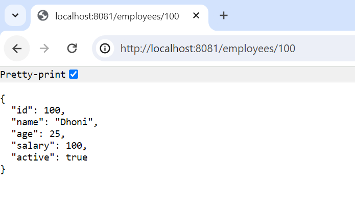

# Introduction :-
In this guide we are going to discuss about

1) Entity creation

2) Repo creation

3) Service Creation

4) Controller Creation

5) Database configuration in application.properties

6) Adding data.sql with sql queries.

7) Reading Employee Data


### Adding employee package :- 
Let us create a package with name employee in src/main/java/com.learn.employeeservice.




## Employee Entity Creation :-

Let us create a new java class i.e Employee file inside employee folder.




### Adding Fields inside Employee :-
Let us add below fields

1) Id (Long/int type)

2) Name (String type)

3) Age (Integer type)

4) isActive (Boolean type)

5) Salary (Double type)

### Employee class with Fields information :-
```
package com.learn.employeeservice.employee;

import jakarta.persistence.*;
import lombok.Getter;
import lombok.Setter;

@Getter
@Setter
@Entity
@Table(name="employee")
public class Employee {
    @Id
    @GeneratedValue(strategy = GenerationType.IDENTITY)
    private Long id;
    private String name;
    private int age;
    private boolean isActive;
    private double salary;
}


```
### Adding Annotations in employee class

@Entity - The class annotated with @Entity informs spring boot this is
entity class and it can be mapped to a db table.

@Table - Using this annotation we can give database table name.

@Id - Marking specific field as primary key of entity. Eg:- id column.

@GeneratedValue - This annotation is used to specify the primary key generation strategy to use. i.e Instructs database to generate a value for this field automatically. If the strategy is not specified by default AUTO will be used.

@Getter - its shortcut annotation for creating all getter methods

@Setter- shortcut annotation for creating all setter methods.

Let us add all these annotations to the Employee Entity class.

## Final Version of Employee Entity

```
package com.learn.employeeservice.employee;

import jakarta.persistence.*;
import lombok.Getter;
import lombok.Setter;

@Entity
@Table(name="employee")
@Getter
@Setter
public class Employee {
    @Id
    @GeneratedValue(strategy = GenerationType.IDENTITY)
    private Long id;
    private String name;
    private int age;
    private boolean isActive;
    private double salary;
}
```
## EmployeeRepository creation :-

We need Repository to interact with database.
So Let us create EmployeeRepository interface in employee package.



**Note** :- EmployeeRepository is an **interface**. so please select
type as interface while creating file.

#### EmployeeRepository is going to extends JpaRepository.

**JpaRepository** ==> JPA(Java Persistence API) Repository is mainly used for managing the data in a Spring Boot Application.
it contains API for basic CRUD operations and also API for pagination and sorting.
```
public interface JpaRepository<T,ID>
Where:

    T: Domain type that repository manages (Generally the Entity/Model class name)
    ID: Type of the id of the entity that repository manages (Generally the wrapper class of your @Id that is created inside the Entity/Model class)

```

## Adding @Repository annotation to the interface :-

@Repository - indicates that an annotated interface is a repository, which is an abstraction of data access and storage.
So we are going to add @Repository annotation on top of interface.


## Final version of EmployeeRepository


```
package com.learn.employeeservice.employee;

import org.springframework.data.jpa.repository.JpaRepository;
import org.springframework.stereotype.Repository;

@Repository
public interface EmployeeRepository extends JpaRepository<Employee, Long> {
}

```

## EmployeeService Creation :-
To implement main business logic of the application we need service
class. So Let us create EmployeeService inside employee package.


### Adding @Service annotation to EmployeeService Class :-

@Service - indicates that an annotated class is a service class.

```
package com.learn.employeeservice.employee;

import org.springframework.stereotype.Service;

@Service
public class EmployeeService {
    
}
```
## EmployeeRepository object fetching through constructor Injection  :-
EmployeeService needs EmployeeRepository object to fetch data from
database.

By using constructor and @Autowired we are setting EmployeeRepository
object here.

## What is @Autowired?
The Spring framework enables automatic dependency injection i.e automatic object creation(We don't need to create repo object here. spring is going to create object for us) 
So if you mark the constructor/method/field with @Autowired spring is going to take care about object creation. 

## Employee Service code with Repo and Service Annotation :-
```
package com.learn.employeeservice.employee;

import org.springframework.beans.factory.annotation.Autowired;
import org.springframework.stereotype.Service;

import java.util.List;

@Service
public class EmployeeService {

    private EmployeeRepository employeeRepository;

    @Autowired
    public EmployeeService(EmployeeRepository employeeRepository) {
        this.employeeRepository = employeeRepository;
    }
}

```

## Adding methods in Employee Service class :-
Let us add findAllEmployees() method
to fetch all employees from db.

Let us add findEmployee() method to fetch single employee
details from db.

## Final version of Employee Service class :-

```
package com.learn.employeeservice.employee;

import org.springframework.beans.factory.annotation.Autowired;
import org.springframework.stereotype.Service;

import java.util.List;

@Service
public class EmployeeService {

    private EmployeeRepository employeeRepository;

    @Autowired
    public EmployeeService(EmployeeRepository employeeRepository) {
        this.employeeRepository = employeeRepository;
    }

    List<Employee> findAllEmployees() {
        return employeeRepository.findAll();
    }

    Employee findEmployee(Long id) {
        return employeeRepository.findById(id).orElse(null);
    }
}

```
## Adding Employee Controller :-

We are going to create EmployeeController from employee package to expose employee API.


Adding @RestController Annotation and EmployeeService Autowiring to EmployeeController :-

@RestController - marks the class as Api controller, capable of handling the requests.

@RequestMapping - maps HTTP request with a path to a controller method.

We are going to fetch EmployeeService by applying Autowiring.

```
package com.learn.employeeservice.employee;

import org.springframework.beans.factory.annotation.Autowired;
import org.springframework.web.bind.annotation.RestController;

@RestController
public class EmployeeController {
    private EmployeeService employeeService;

    @Autowired // @Autowired is optional.By default spring recognizes this.
    public EmployeeController(EmployeeService employeeService) {
        this.employeeService = employeeService;
    }
}
```
## Adding methods to EmployeeController 


Let us add getAllEmployees() method to fetch all employees.
getEmployee() method to fetch single employee information.

@RequestMapping - maps HTTP request with a path to a controller method.
@GetMapping - maps HTTP Get request with a path to a controller method.

```
package com.learn.employeeservice.employee;

import org.springframework.beans.factory.annotation.Autowired;
import org.springframework.web.bind.annotation.GetMapping;
import org.springframework.web.bind.annotation.PathVariable;
import org.springframework.web.bind.annotation.RequestMapping;
import org.springframework.web.bind.annotation.RestController;

import java.util.List;

@RestController
@RequestMapping("/employees")
public class EmployeeController {
    private EmployeeService employeeService;

    @Autowired // @Autowired is optional.By default spring recognizes this.
    public EmployeeController(EmployeeService employeeService) {
        this.employeeService = employeeService;
    }

    @GetMapping("/all")
    public List<Employee> getAllEmployees() {
        return employeeService.findAllEmployees();
    }

    @GetMapping("/{id}")
    public Employee getEmployee(@PathVariable("id") Long id) {
        return employeeService.findEmployee(id);
    }
}

```

## Adding H2 Database configurations in application.properties

To Add configurations to our spring boot project we are going to use
application.properties.

application.properties is available in src/main/resources path.



Add  below configurations in application.properties
```
spring.application.name=employeeservice
spring.datasource.url=jdbc:h2:mem:employeeServiceDb
spring.datasource.username=admin
spring.datasource.password=
spring.jpa.hibernate.ddl-auto=update
spring.jpa.defer-datasource-initialization=true
spring.h2.console.enabled=true
```

## Adding default data to the database.
We can also add data to the database by creating data.sql
inside src/main/resources path.



Please copy this data to data.sql

```
insert into employee(id, name, age, is_active, salary) values(100,'Dhoni', 25, true, 100);
insert into employee(id, name, age, is_active, salary) values(101,'Virat', 35, true, 350);
insert into employee(id, name, age, is_active, salary) values(102,'Sachin', 45, false, 300);
insert into employee(id, name, age, is_active, salary) values(103,'SunilGavaskar', 55, false, 400);
insert into employee(id, name, age, is_active, salary) values(104,'KapilDev', 65, false, 500);

```

## Rerun Application :-

Rerun your application and check is there any errors in console.
you can access these urls.

1) http://localhost:8080/employees/all



2) http://localhost:8081/employees/100



## Congratulations
Congratulations :) Now You are able to build crud application in the  project code from intellij.


